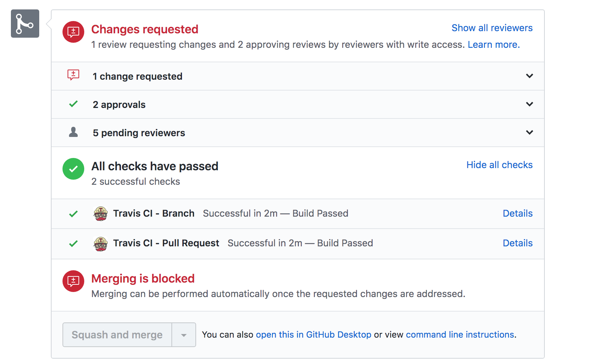
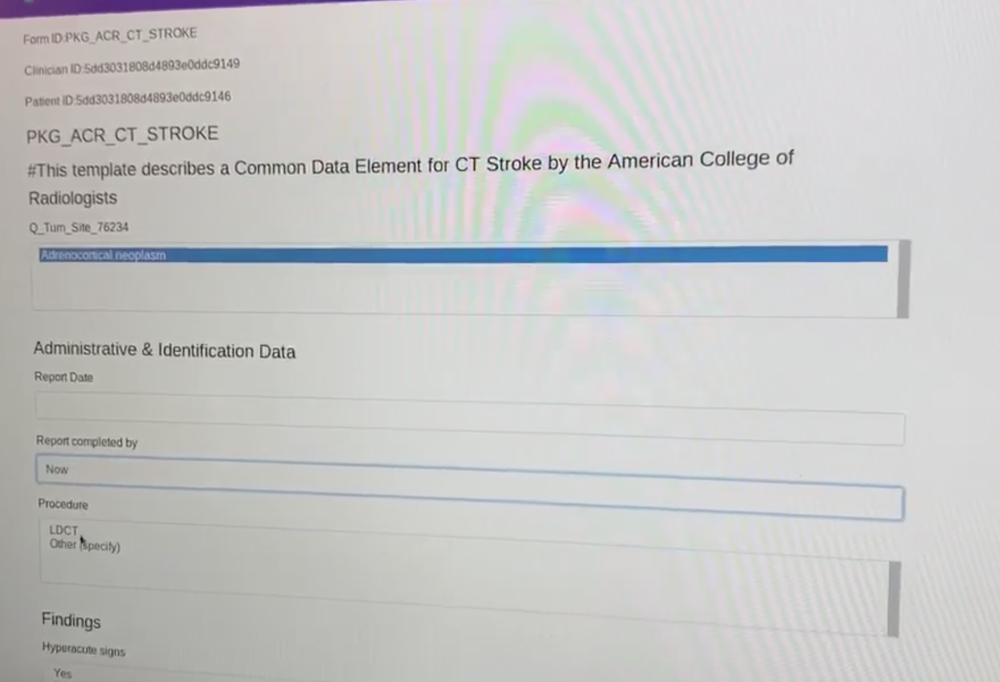
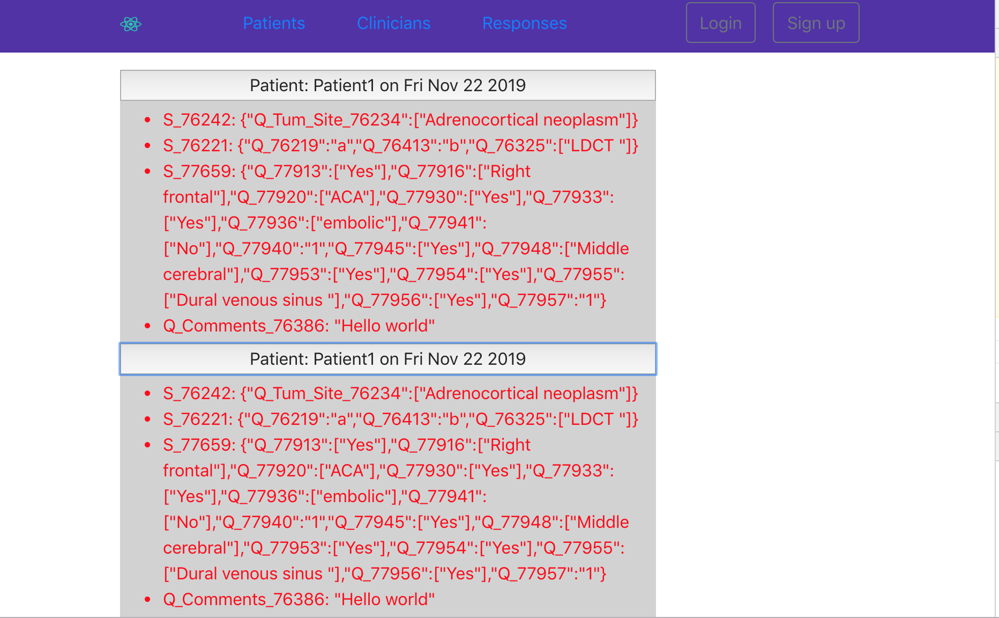
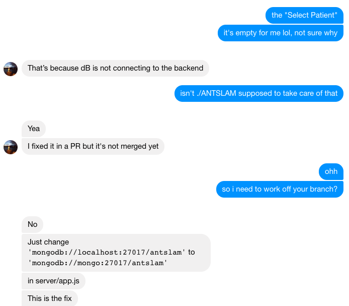
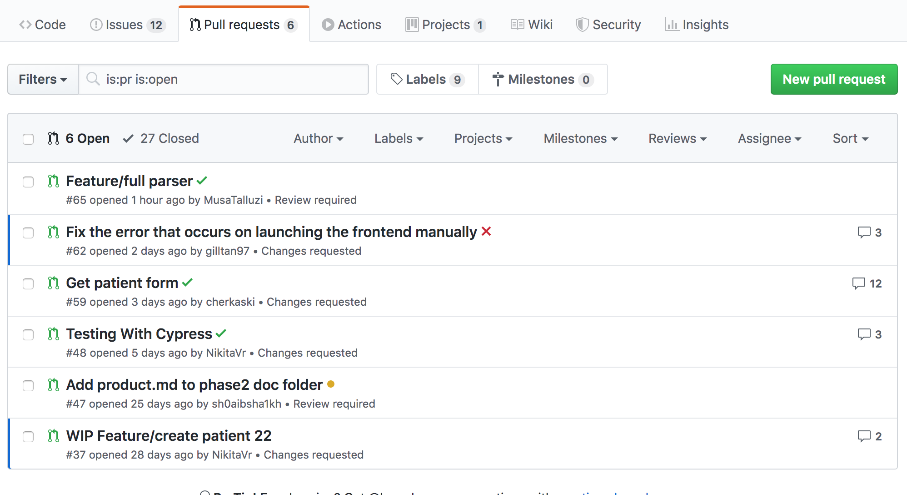
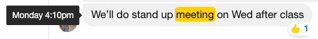
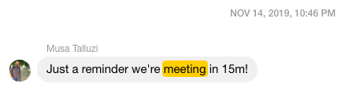
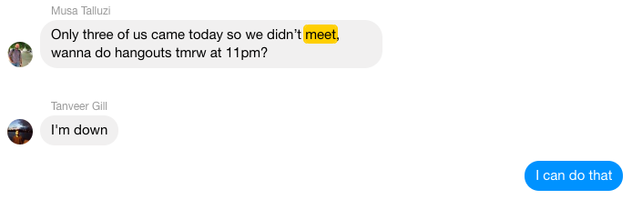
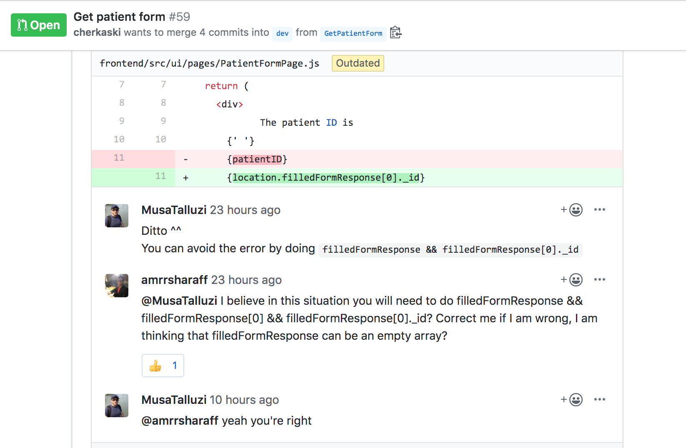

# What We Built During This Phase

The things we built were as follows:

- Frontend:
  - HomePage:
    - get FormResponse of patient and procedure, redirect application to /FillFormPage to continue editing (Alex & Musa)
    - prevents users from creating a new FormResponse if one already exist (Musa)
  - FormResponses: Parse form submission object returned by react-jsonschema and display it in a human-readable form under the FormResponses tab. (Amr)
  - End to end testing: Cypress & Travis (Nikita)
  - Feedback upon successful submission (Shoaib)
- Backend:
  - Parse entire xml document (Lana & Musa)
  - FormResponse: create endpoint to get a response for patientName and procedureName (Tanveer)
  - Error and change handling in a form (Shoaib)
- DevOps:
  - Docker: launch all applications together (Tanveer)
  - Heroku: deploy application (Shoaib)

## In-Depth Overview

- Frontend:

  - Homepage, FormResponses, & Corresponding Endpoints: Add Retrieval functionality for reviewing previously input FormResponses in the frontend and allow users to view the specified formResponses. Ensure easy navigation from Homepage to FormResponses, and integrate this functionality with its corresponding backend task. Display form responses of all patients in human readable format with every question and its corresponding response. We added a simple alert to notify the user when the form has been submitted.
  - Cypress & Travis Integration: Because this project is multifaceted, we needed to ensure that we had the correct programming practices and were contributing to code efficiently. Therefore, we integrated Cypress and Travis for our end-to-end testing infrastructure. Moreover, to ensure no changes break the build, Travis tests are run automatically on every PR and could block the merge. This maintains accountability and seamless integration, in addition to code quality. We can now setup tests, write tests, run tests, and debug them.
    

- Backend
  - Full XML Parser that can take in a whole DTD and render it in the front end: We first parse the XML structure into a JSON object. The next step is to translate the JSON DTD into a json-schema object. The react-jsonschema-form library renders a json-schema object as a form in the front end. Because the DTD is a recursive structure, we needed to understand its basic skeleton before we designed the algorithm. Therefore, we built the json-schema step by step. We saw that a DTD structure follows the specific rules:
    - Body: can only contain 1 ChildItems
    - ChildItems : can contain 1 or more Section and Question
    - Section: A way to group data, can contain 1 ChildItems
    - Question: contains a question title, and one of two types of answers: ResponseField, ListField
    - ResponseField: Basecase to our Form structure, the structure that does not require any recursion. The node in our form.
    - ListField: List: 1 or more ListItems (or ChildItems) for multiple choice questions
    - ListItems: Base case for the schema, just contians the title and no children, to be used in the checkboxes
    - Note that most MC questions contain an "other" field, which requires an input. Thus, a ListField child could be a ChildItem of type ResponseField.
    - Following these rules, we built a recursive algorithm whose base cases are response fields and listitems, and the recursive case is any Section or ChildItem. We then ensured that the form is parsable and correctly displayed in the front end.

## How It's Different From Original Proposal

In our original proposal, we said we would show one question at a time because we were parsing our JSON in the backend. However, after writing the parser, we saw that this procedure wasn't necessary. Now we have the entire form available at the press of the button. We haven't yet implemented queries on the data, which were mentioned in our original proposal.

# High-level Design

On a high level, our web application accepts a Procedure ID, Patient ID, and Clinician ID, and then returns the specified empty form for filling. The XML DTD is parsed from XML to [json-schema](https://json-schema.org/) in the server, and then rendered in the frontend using [react-jsonschema-form](https://github.com/rjsf-team/react-jsonschema-form). Once the form is filled and edited, the user submits the form and recieves an alert that the form has succesfully been submitted, and we store it in the MongoDB database. FormResponses can be retrieved and viewed in a human-readable manner by retrieving the responses from our database.

# Technical Highlights

## Interesting Bugs

Issues are classified with enhancement or bug tags, while features have no specified tag. The two bugs we're currently working with are:

- Error when manually launching frontend: the launch succeeds when using Docker but needs to be looked into further
- Invalid getFormResponses query returns empty array with status code 200: We would need to check whether the patient and procedure IDs were valid before presenting them.

## Challenges

Deploying on Heruko became a bigger challenge than we previously expected. In the beginning, our repository didn't have a permission to connect to Heroku. After that permission was granted, we encountered a bigger problem. In order to deploy to Heroku, the `package.json` file should be in the root directory of our repository. However, since we have two subfolders in our project for backend and frontend, and each subfolder has its own `package.json`. This causes the build to fail because Heroku is not able to identify what kind of project this is. After doing some investigation, the common fix for this is to have two separate repositories for the backend and frontend, but since we are only given one, this is a problem. This has all been documented in an issue so that the team is aware of the problem. Another challenge was programming the parsed JSON recursively, accurately, and aesthetically, but with hard work we were able to get it launched.

- Another challenge, which we were anticipating, is coming up with a way to display the then-parsed form submissions taking into account their inconsistent structure.  
  <b>Situation</b>: We are using react-jsonschema-form library to convert the form submissions into json. The library is great. However, with every form having its own set of unique questions, it is difficult to create a generic react component that can display the results of all forms.  
  <b>Action</b>: The most generic solution is to go over the question:answer json object and display key to value rows.  
  <b>Result</b>: The result is good for P2. We have a list of question ids along with their answers displayed.
  
  While this is likely not the perfect UX for real-world applications, we are planning to carefully study the json object produced by jsonschema and coming up with assumptions that can make our generic react component more specific and human-readable.

- Having consistent code style among group members presented a minor challenge.  
  <b>Situation</b>: Each of us has a separate linter for their code style. 
  <b>Action</b>: A specific linting style was enforced by the build script using ESLint, such that the build will fail if the author of the PR does not follow the linting guidelines. 
  <b>Result</b>: Consistent linting across all PRs, which makes code readability more consistent and easier. 

## Lessons Learned

One of the lessons we learned was to always ask for help if there's something we're not sure about. Instead of wasting time trying to debug an issue on our own, someone might already know the fix. There are several messages on our group where members are asking for verification or tips on how to deal with the program, and all our members are always ready to help. If someone working on the frontend is having difficulty connecting to the backend of our application, team members responsible for backend will chime in. An example of this is when some members were having difficulty connecting to MongoDB which was affecting their ability to test their work (image attached below). We also learned how to further our understanding of the overall stack by having several members work on several levels of the project such as the frontend, algorithms, and database. Furthermore, we learned how to perfect our code contribution techniques with several PRs being commented on, having changes requested, and tested with Travis, before being merged.

## Observations

Our observations were that testing code as a gateway to pushing kept our branches healthy and away from any risks/errors, and that the project itself has been going along a very nice trajectory. All team members have been contributing and passionately working away to ensure a user-friendly and functioning application, and this hard work can be observed by the strides we've been making on all aspects of our app (frontend, database, parser, tests, etc...).

# Teamwork and Process

We started this phase by meeting as a group and discussing the milestones we wanted to reach for P2. We set out a roadmap with assigned tasks and created Github issues for each of them. Throughout the weeks leading up to the P2 demo, we would discuss which frameworks we would like to use (such as Selenium vs Cypress) and coding practices we would like to keep going. Some tasks were worked on by more than one person, such as someone working on the backend and another working on the frontend of the same response fetch task. Our process also evolved such that the owner of a pull request would assign all reviewers to the PR, but directly messaging members who are more well-versed with the task for a direct review. This asserted that every PR had a timely review, while ensuring that all members of the team were notified when PRs were requested. We also worked together on designing an improved UML model. We discussed the pros and cons of different techniques and updated our UML accordingly. We would aim to have a standup meeting to discuss work completed, work to be done, and if there are any blockers. If we couldn't meet in person, we would meet online on Google Hangouts.

## What Worked Well

Our communication, efficiency, and choice of process worked extremely well. Our communication worked extremely well since we're all active on our messaging group. Whenever feedback is requested, a question is asked, or a PR is requested, the team members are quick to respond and contribute. Our efficiency and process also worked extremely well since whenever a change, feature, or change was requested, team members started working right away and left us with a lot of time to test and comment on each others work.

## What Needs Improvement

Thankfully, our team has been working pretty well together. We have no major coordination issues.

Our improvement plans include:

- Writing more thorough bug reports. Our bug reports are usually understood since we talk about it in person beforehand. However, a week after the bug report is made, the group members can possibly forget the details that were assumed in the bug report. For P3, we are planning to add more details in the issues we create, so that everyone on the group can understand without having to be in the meeting.
- It is a busy time of the semester, and not all of us have the time to keep up with what each other group member is doing on the app. Our plan for P3 is to take sometime off in the beginning of every meeting for each group member to say something they have learnt from what they have worked on in the previous sprint. Regardless of the level of expertise, this will be beneficial to all group members to further solidify our understanding of web development.

# What We Will Build For Phase 3

For phase 3, we will add a custom "other" response field to multiple choice, support querying responses, and work towards hosting our website. We will also work on creating a persistent link to the response specified if we have the time before p3. In the end, we want our project to be presentable, so this will include cleaning up the UI, adding UX enhancements (such as redirecting to the homepage after successful form submission), etc.
